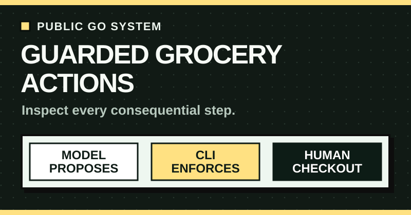
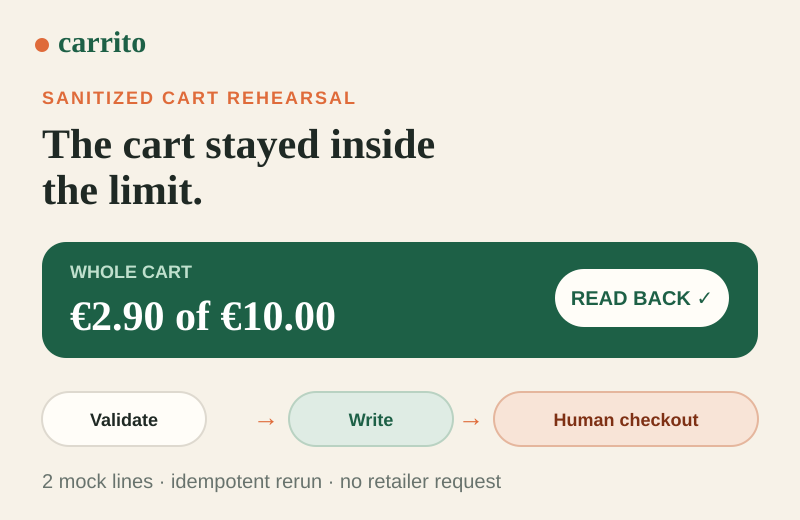
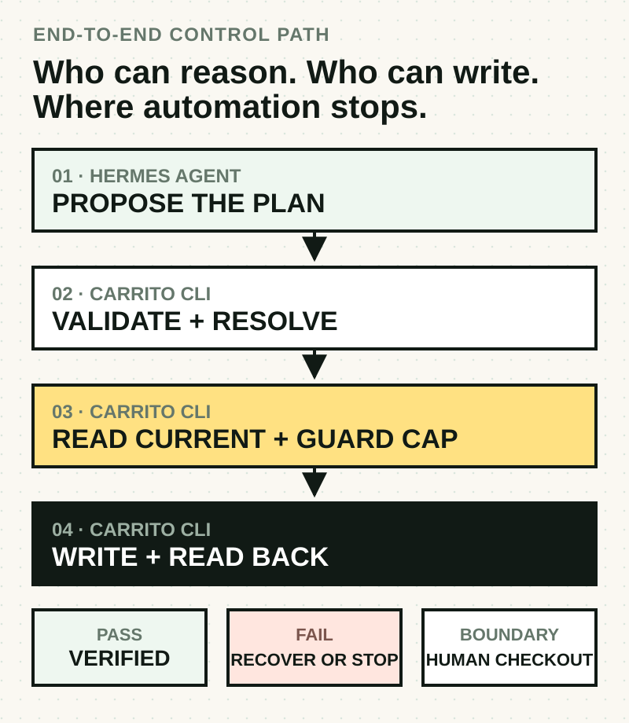

<p align="center">
  
</p>

<p align="center">
  <strong>Turn a household meal request into a cooking page and a guarded grocery cart.</strong><br>
  Plan flexibly. Enforce the limit. Keep checkout human.
</p>

<p align="center">
  <a href="https://wachtermar.github.io/carrito/"><strong>Run the public safety demo</strong></a>
  &nbsp;·&nbsp;
  <a href="./docs/architecture.md">Inspect the architecture</a>
  &nbsp;·&nbsp;
  <a href="#install-for-hermes">Install for Hermes</a>
</p>

## Try the spending guard

<p align="center">
  <a href="https://wachtermar.github.io/carrito/">
    
  </a>
</p>

The [interactive browser walkthrough](https://wachtermar.github.io/carrito/) runs a sanitized, session-only cart fixture. Set the cap below **€2.90** to see the write refuse before mutation; set it to **€2.90 or more** to mutate the in-memory cart and verify a separately read snapshot. Run it twice to inspect the idempotent path. It makes no retailer request and never reaches checkout. [Open the full successful-run capture →](./docs/assets/demo-preview.png)

For executable proof, the repository's focused Go integration test runs candidate resolution, output generation, guarded mutation, read-back, and an idempotent second run against a stateful local mock:

```sh
go test ./internal/cli \
  -run TestMealPlanCandidatesBuildAndGuardedCartReadback \
  -v
```

## From dinner idea to checked cart

1. **Hermes designs recipes** for the actual household.
2. **Carrito resolves current products** and validates the plan.
3. **The user approves a whole-cart maximum spend.**
4. **Carrito writes and reads back** exact quantities and the final total.
5. **Hermes returns a mobile cooking page.**
6. **A person owns checkout, substitutions, delivery, and payment.**

<p align="center">
  
</p>

| Boundary | Invariant | Failure behavior |
|---|---|---|
| Model → CLI | Plan JSON is untrusted input. | Invalid schema or unresolved products exit nonzero. |
| CLI → retailer | Authentication, CSRF, readable EUR total, and a positive explicit cap are required. | Refuse before mutation. |
| Write response → persisted state | A successful response is not final proof. Quantities and whole-cart total must be read back. | Reverse only Carrito's own deltas when safe; otherwise require manual review. |
| Cart → checkout | The CLI has no checkout or order-submission command. | A person reviews and completes the purchase. |

[Read the source-linked architecture and safety flow →](./docs/architecture.md)

## Install for Hermes

Requirements: Hermes Agent, Go 1.25 or newer, macOS or Linux.

```sh
git clone https://github.com/wachtermar/carrito.git
cd carrito
./install-skill.sh
```

The installer copies the complete multi-file skill to `~/.hermes/skills/carrito-shopping` and builds `carrito` into `~/.local/bin`. It does not open a login window unless requested:

```sh
./install-skill.sh --login
```

From a published GitHub source, install the skill directory so Hermes receives its reference and template files:

```sh
hermes skills install wachtermar/carrito/skills/carrito-shopping
```

Then ask Hermes:

```text
/carrito-shopping Plan five simple dinners for two adults and a toddler,
avoid peanuts, add the groceries to my Alcampo cart, and give me the cooking page.
```

Hermes asks only for missing hard facts and the final-cart spending cap. Login happens in a local browser form; credentials do not go through chat.

## The small contract

Hermes writes one plan JSON containing household rules, day-by-day meals, a consolidated shopping list, and the selected candidate SKUs. The exact format is documented in [`plan-format.md`](./skills/carrito-shopping/references/plan-format.md).

```sh
carrito mealplan validate plan.json --json
carrito mealplan candidates plan.json --limit 4 --json
carrito mealplan build plan.json \
  --html-out family-plan.html \
  --basket-out family-plan.basket.txt \
  --json
```

`candidates` returns `status: "ready"` only when every shopping line has usable products. Otherwise it reports `status: "incomplete"`, includes `unresolved_count`, and exits nonzero.

Before approval, Hermes reads the current cart so the user sees the whole-cart total:

```sh
carrito login-web --if-needed --json
carrito cart get --json
```

After explicit approval:

```sh
carrito cart set-many -f family-plan.basket.txt --max 100 --json
```

Basket quantities are minimum targets: `set-many` raises named products when needed, never reduces a larger existing quantity, and leaves unrelated lines alone. It reports `verified: true` only after read-back confirms exact quantities and final total. If verification fails after a confirmed write, recovery is bounded to Carrito's own deltas. Ambiguous outcomes stop for manual review.

## Scope and safety

Carrito contains no embedded recipe database, pantry engine, nutrition ledger, readiness matrix, PDF pipeline, checkout flow, or order submission. It is unofficial and is not affiliated with Alcampo or Auchan. Private web APIs may change. Product labels and physical packaging remain authoritative for allergies.

Configuration is stored in `~/.carrito/config.toml` with mode `0600`. Set `CARRITO_CONFIG_DIR` to isolate it. `CARRITO_BASE_URL` is intended only for a mock or test server.

## Development

```sh
make check
```

This runs formatting checks, unit and integration tests, `go vet`, an installer clone smoke test, and a clean build. Tests use local mock servers and do not mutate a real cart. See [`docs/cli.md`](./docs/cli.md) for the command reference and [`docs/hermes-integration.md`](./docs/hermes-integration.md) for the agent contract.
